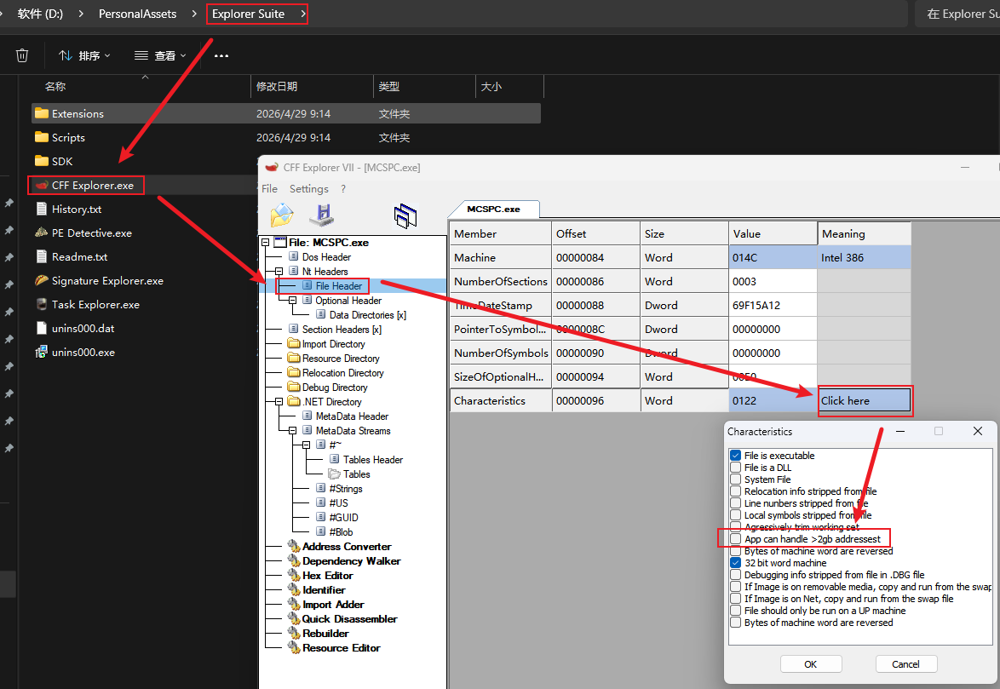

public:: true
tags:: [[PE 文件工具]]
category:: 软件工具

- # 功能
	- ## 查看与修改 Large Address Aware 配置
		- 支持查看与修改，适用于单次 Large Address Aware 修改配置。
		  id:: 69f17040-9a0b-4e2e-b07c-600acff19684
		- 
		  id:: 69f1717f-1465-42ee-97ab-d608f2d28e14
-
- # 工具下载
	- 下载地址：((69f17095-26a7-4a83-bdb0-caabcc9b929a))
	  id:: 69f170b5-e05d-48cc-8d8c-b718e3b4633b
-
- # 相关参考
	- [Explorer Suite – NTCore](https://ntcore.com/explorer-suite/)
	  id:: 69f17095-26a7-4a83-bdb0-caabcc9b929a
	- [CFF Explorer: 一款Windows PE 文件分析的好工具-CSDN博客](https://blog.csdn.net/haokan123456789/article/details/153465528)
-
-