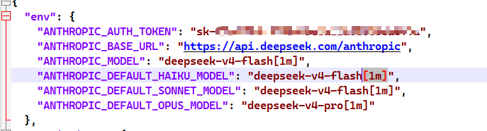
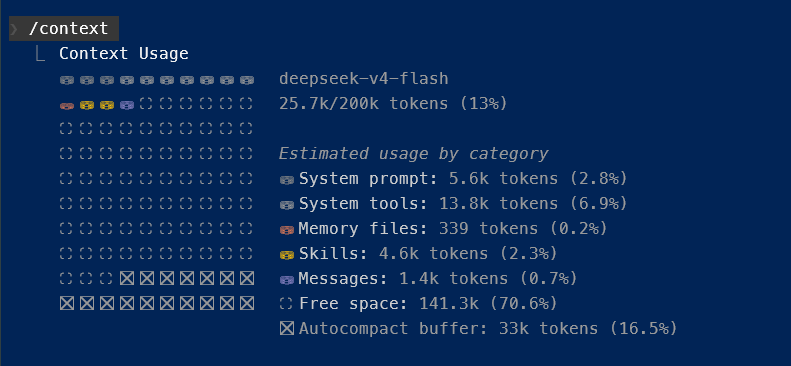
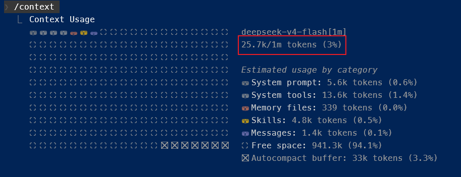

tags:: #DeepSeek, #LLM

- # 官方网站
	- [首次调用 API | DeepSeek API Docs](https://api-docs.deepseek.com/zh-cn/)
		- ((9290db11-7195-4954-9e85-f4a550afa21d))
		- ((fa3fa02d-a4d9-4edd-b3b2-9b77202b6da8))
		- ((3032f24b-fef0-4dc6-a002-d379943ac5ed))
		- ((13251b1b-44d2-4ba3-a894-d2dce754d522))
		  id:: b8cd6164-f36a-4e42-820d-7ff91e9c4cc8
- # Url 格式
	- **参考：** ((fa3fa02d-a4d9-4edd-b3b2-9b77202b6da8))
	- ## OpenAI 格式
		- **BASE URL (OpenAI 格式)：**` https://api.deepseek.com/`
	- ## Anthropic 格式
	  id:: 6a0d0665-b366-44b2-930c-02b6c909e266
		- **BASE URL (Anthropic 格式)：** `https://api.deepseek.com/anthropic`
		  id:: 6a0d0671-3132-4cac-b3ab-b3381b3d72a5
		- **配置参考：** ((26137ce1-7019-4933-b13e-26ffe35ea853))
		- **deepseek-v4-flash**，**deepseek-v4-pro** 模型配置支持1M上下文
			- 如下图所示，在模型末尾之后增加 ==[1m]== 的配置
			  
			- Claude Code 中查看上下文变化，修改前：
			  {:height 326, :width 687}
			  修改后：
			  
- # 动态
	- [DeepSeek-V4 预览版：迈入百万上下文普惠时代](https://mp.weixin.qq.com/s/8bxXqS2R8Fx5-1TLDBiEDg)
- # 相关参考
	- [首次调用 API | DeepSeek API Docs](https://api-docs.deepseek.com/zh-cn/)
	  id:: 9290db11-7195-4954-9e85-f4a550afa21d
	- [模型 & 价格 | DeepSeek API Docs](https://api-docs.deepseek.com/zh-cn/quick_start/pricing/)
	  id:: fa3fa02d-a4d9-4edd-b3b2-9b77202b6da8
	- [Token 用量计算 | DeepSeek API Docs](https://api-docs.deepseek.com/zh-cn/quick_start/token_usage)
	  id:: 3032f24b-fef0-4dc6-a002-d379943ac5ed
	- [DeepSeek 开放平台 - 用量信息](https://platform.deepseek.com/usage)
	  id:: 13251b1b-44d2-4ba3-a894-d2dce754d522
	- [接入 Agent 工具 | DeepSeek API Docs](https://api-docs.deepseek.com/zh-cn/guides/coding_agents)
	  id:: 26137ce1-7019-4933-b13e-26ffe35ea853
-
-