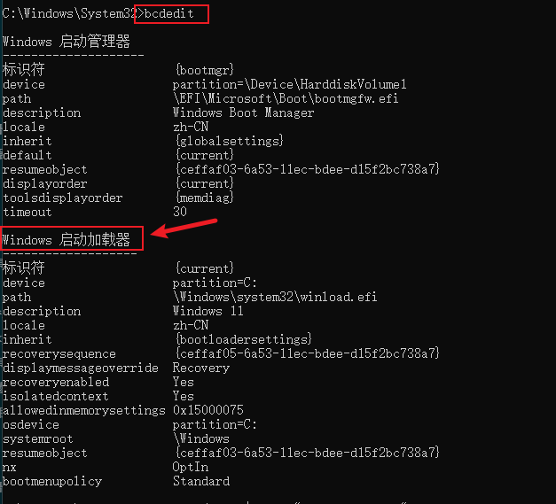
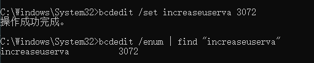
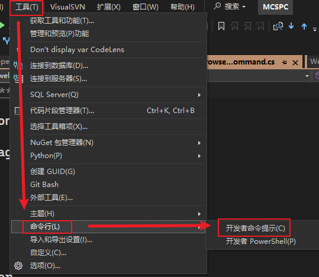
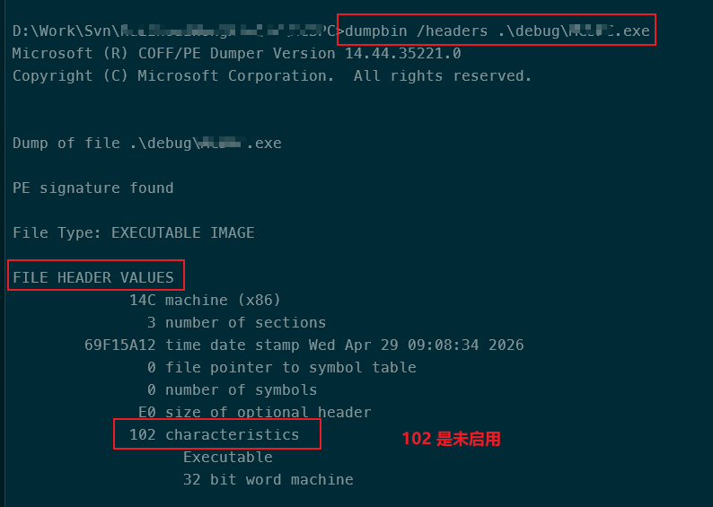
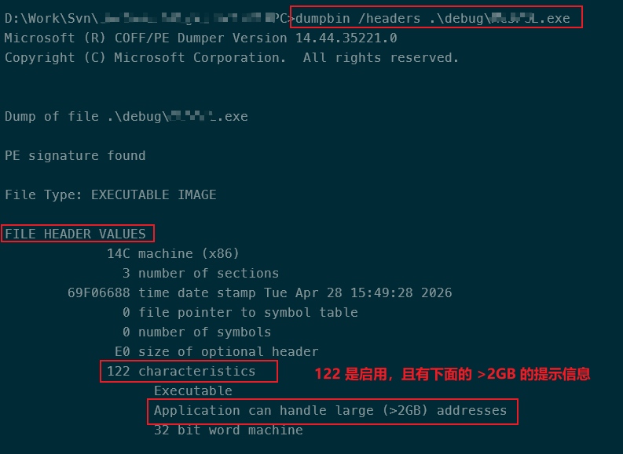

public:: true
tags:: 桌面应用程序
category:: 文章

- # 解决的问题
	- 解决x86编译出来的.NET程序突破默认的2G内存限制，用以缓解程序的内存使用紧张问题或提示内存不足的问题。
-
- # 摘要
	- 要让以 x86 架构运行的 .NET WinForm 程序突破默认的 2GB 用户态内存限制，核心方法是为程序开启 **“大地址感知” (Large Address Aware)** 功能。
	- 开启后，程序的内存上限会因操作系统而异：
	  > **在 32 位 (x86) 操作系统上**：上限可提升至 **3GB**。
	  **在 64 位 (x64) 操作系统上**：上限可提升至 **4GB**。
	- #+BEGIN_IMPORTANT
	  如果程序运行在 32 位系统上，想要真正用满 3GB 空间，还需要手动开启操作系统级的 3GB 开关（方法详见： ((69f17b86-7516-4735-a5a6-09f7c8292d0e)) ）。
	  #+END_IMPORTANT
- # 32位 (x86) 操作系统下的额外配置
  id:: 69f17b86-7516-4735-a5a6-09f7c8292d0e
	- #+BEGIN_IMPORTANT
	  如果程序必须运行在 32位 (x86) 操作系统上，仅对程序本身进行设置还不够。为了让 32 位系统把 3GB 的虚拟地址空间分配给用户态，还需要手动开启系统级的“3GB 开关”。
	  #+END_IMPORTANT
	- ## 查询于配置操作步骤
		- #+BEGIN_IMPORTANT
		  必须以管理员身份运行CMD窗口。
		  #+END_IMPORTANT
		- ### 查询配置
			- ```cmd
			  // 通过CMD查询，如果输出的内容是空的表示无此配置。
			  bcdedit /enum | find "increaseuserva"
			  
			  // 或列出所有配置，然后在 【Windows 启动加载器】中查找 increaseuserva 的配置。
			  bcdedit
			  
			  // 在PowerShell中使用此命令
			  bcdedit /enum | Select-String "increaseuserva"
			  ```
			- 如下图所示，未找到表示没开启配置。
			  
		- ### 设置 increaseuserva 配置为 3G = 3072
			- `bcdedit /set increaseuserva 3072`
			- 如下图所示，设置完成之后再验证配置是否设置成功
			  
			- #+BEGIN_IMPORTANT
			  ==注意：== 设置完成之后请重启电脑。
			  #+END_IMPORTANT
		- id:: 69f17c7d-4731-43f1-8fad-e23f8b78812e
- # 查询程序的 Large Address Aware 配置开关
	- ## 方式一
		- ### 使用 [[PE 文件工具]] [[CFF Explorer]]
		  id:: 69f16e35-e908-47a2-824f-0a3b3b3482dd
			- ((69f17040-9a0b-4e2e-b07c-600acff19684))
			  ((69f1717f-1465-42ee-97ab-d608f2d28e14))
			- 下载地址： ((69f17095-26a7-4a83-bdb0-caabcc9b929a))
	- ## 方式二
		- ### 使用 [[dnSpy]]
		  id:: 69f17316-5483-492f-8ef2-2653d9d84aa2
			- ((69f174c4-63a6-481b-8b27-8e6dd1fa7f3c))
			- ((69f174d6-a99d-49a7-ba56-b77f6cc6a157))
			- ((69f175f6-5863-46ad-9ae7-f1d74b491123))
	- ## 方式三
		- ### 通过 Visual Studio 开发者命令提示窗口操作。
			- 只适用于查看应用程序的 Large Address Aware 的配置开关，查看步骤如下：
			- 1、通过工具 - 命令行 - 开发者命令提示菜单打开命令行窗口，如下图所示
			  
			- 2、通过命令 `dumpbin /headers 程序名称.exe` 来查询，如下图所示：
			  未启用 Large Address Aware 的查询截图：
			  
			  已启用 Large Address Aware 的配置截图：
			  
			-
- # 启用程序的 Large Address Aware 配置开关
	- ## 方式一
		- {{embed ((69f16e35-e908-47a2-824f-0a3b3b3482dd))}}
	- ## 方式二
		- {{embed ((69f17316-5483-492f-8ef2-2653d9d84aa2))}}
	- ## 方式三
		- ### 使用 NuGet 包  `dotnetCampus.LargeAddressAware`  (推荐)
			- 这是最自动化、最推荐的方式，因为它会自动集成到 MSBuild 构建流程中，无需手动配置 `editbin` 路径，也适用于较新的 SDK 风格项目。
			- **操作步骤**:
				- 在 Visual Studio 中，右键点击您的项目，选择“管理 NuGet 包”。
				  logseq.order-list-type:: number
				- 搜索并安装 `dotnetCampus.LargeAddressAware` 到您的项目中。
				  logseq.order-list-type:: number
				- 完成安装后，每次构建生成的 `.exe` 文件都会自动启用大地址感知标志。
				  logseq.order-list-type:: number
				- #+BEGIN_TIP
				  如果项目使用的是 PackageReference 格式，也可以通过编辑 .csproj 文件来安：
				  #+END_TIP
					- ```
					  <!-- 在 .csproj 文件的 <ItemGroup> 节点中添加 -->
					  <PackageReference Include="dotnetCampus.LargeAddressAware" Version="1.0.2" />
					  ```xml
	- ## 方式四
		- ###  编辑项目文件 ( `.csproj` )
			- 如果您不想依赖外部 NuGet 包，并且项目使用的是较新的 SDK 风格项目文件，这是一种很直接的方法，但仅适用于 .NET 5 及以上版本。
			- **操作步骤**: 使用文本编辑器或 Visual Studio 打开您的 `.csproj` 文件，在 `<PropertyGroup>` 节点中添加以下配置即可。
				- ```xml
				  <!-- 在 .csproj 文件的 <PropertyGroup> 节点中添加 -->
				  <EnableLargeAddressAware>true</EnableLargeAddressAware>
				  ```
	- ## 方式五
		- ### 手动执行 editbin /largeaddressaware 命令
			- 适用于偶尔适用的场景。
			- 操作步骤：
				- 找到 Visual Studio 的“开发人员命令提示符”(Developer Command Prompt)。
				  logseq.order-list-type:: number
				- 使用 `cd` 命令切换到编译后 `.exe` 文件所在的目录。
				  logseq.order-list-type:: number
				- 运行命令：`editbin /largeaddressaware YourApp.exe`。
				  logseq.order-list-type:: number
-