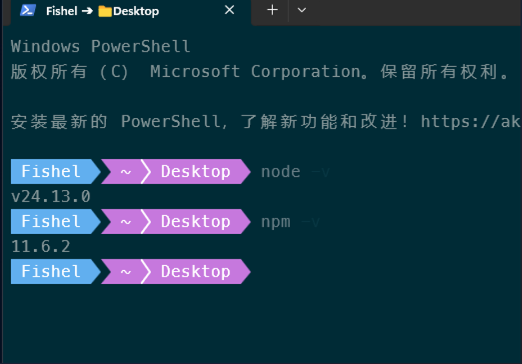
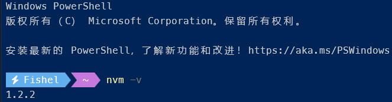
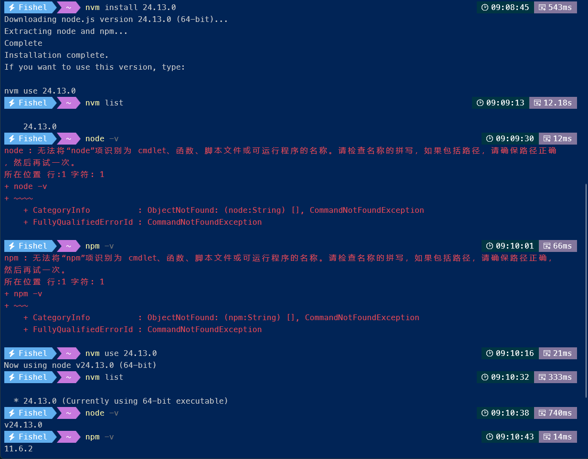

public:: true
tags:: React , Node.js,  环境配置
category:: 开发工具

- # 介绍
	- nvm（Node Version Manager）是一个用于管理多个Node.js版本的工具。在Windows系统中，我们使用的是nvm-windows，它允许你在同一台电脑上安装、切换和管理多个Node.js版本，避免版本冲突问题。
- # 作用
	- 管理多个Node.js版本，方便使用和切换。
-
- # 官方网站
	- [coreybutler/nvm-windows](https://github.com/coreybutler/nvm-windows)
	  > A node.js version management utility for Windows. Ironically written in Go.
		- [Releases · coreybutler/nvm-windows](https://github.com/coreybutler/nvm-windows/releases)
-
- # 安装与配置
	- ## 安装前检查
		- 如下图所示
		  
		- 表示本机以及安装了Node.js的v24.13.0版本，需要先进行卸载：
			- 打开 控制面板 - 程序和功能，找到 Node.js 进行卸载。
			  logseq.order-list-type:: number
			- 执行如下命令删除残留文件，==建议手动找到目录删除，别通过命令删除防止错删程序==。
			  logseq.order-list-type:: number
				- ```powershell
				  Remove-Item -Path "D:\Program Files\nodejs" -Recurse -Force -ErrorAction SilentlyContinue
				  Remove-Item -Path "C:\Users\Fishel\AppData\Roaming\npm-cache" -Recurse -Force -ErrorAction SilentlyContinue
				  Remove-Item -Path "C:\Users\Fishel\AppData\Local\npm-cache" -Recurse -Force -ErrorAction SilentlyContinue
				  ```
			- 清理环境变量
			  logseq.order-list-type:: number
				- 按`Win + R`，输入`sysdm.cpl`，打开“系统属性”
				- 点击“高级” → “环境变量”
				- 在“系统变量”和“用户变量”的`Path`中，删除所有包含`nodejs`或`npm`的路径条目
			- 验证清理结果
			  logseq.order-list-type:: number
				- 打开命令提示符，输入`where node`，如果返回“信息: 未找到匹配的文件”，说明清理完成。
		- ## 安装 NVM
			- 从 [nvm-windows/releases](https://github.com/coreybutler/nvm-windows/releases) 下载最新程序 [nvm-setup.exe](https://github.com/coreybutler/nvm-windows/releases/download/1.2.2/nvm-setup.exe)。
			  logseq.order-list-type:: number
			- 双击exe，进行安装，注意安装目录选择 ==无空格、无中文的路径==。
			  logseq.order-list-type:: number
			- 验证安装
			  logseq.order-list-type:: number
				- 
			- 配置
			  logseq.order-list-type:: number
				- 国内用户建议配置淘宝镜像源，加速Node.js和npm的下载。
				- **找到settings.txt文件**在nvm安装目录下（如`D:\nvm`），找到`settings.txt`文件。
				- **添加镜像配置**
					- 用记事本打开`settings.txt`，追加以下内容：
						- ```textile
						  node_mirror: https://npmmirror.com/mirrors/node/
						  npm_mirror: https://npmmirror.com/mirrors/npm/
						  ```
		-
- # 命令与使用
	- ```powershell
	  // 查看已安装的版本
	  nvm ls
	  // 或
	  nvm list
	  
	  // 查看可安装的 Node.js版本
	  nvm list available
	  
	  // 安装指定版本
	  nvm install 24.13.0
	  
	  // 切换当前版本
	  nvm use 24.13.0
	  
	  // 验证版本
	  node -v
	  npm -v
	  
	  // 卸载指定版本
	  nvm uninstall 16.20.2
	  ```
	- {:height 593, :width 749}
-
- # 相关参考
	- [Windows系统使用nvm实现多版本切换Node.js详细教程](https://www.e-com-net.com/article/2043400130014535680.htm)
	-