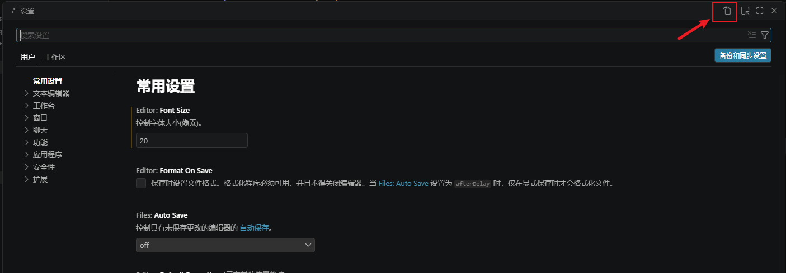
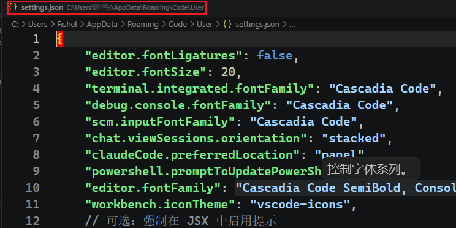
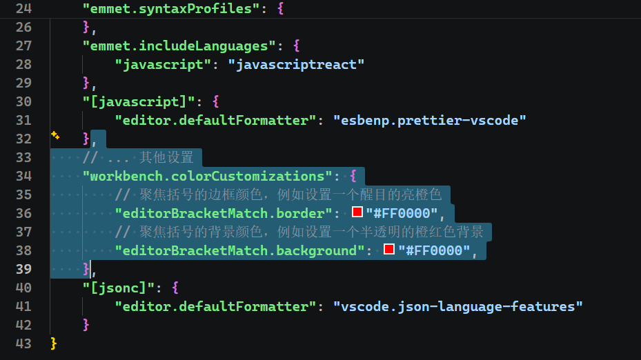
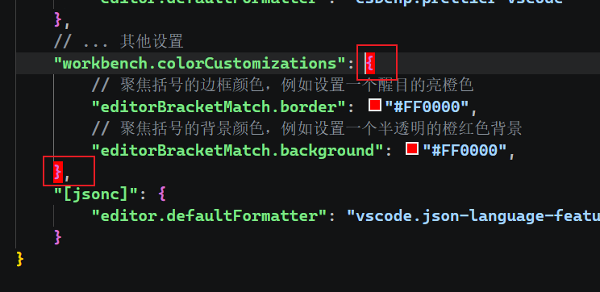

tags:: IDE, React, C#
category:: 开发工具

- # 快捷键
	- 常用的 VS Code 快捷键：
	  |快捷键|功能|
	  |--|--|
	  |Ctrl + ,|打开设置|
	  |Ctrl + Shift + X|打开扩展|
	  |Ctrl + Shift + E|打开资源管理器|
	  |Ctrl + Shift + X|打开扩展|
	  |Ctrl + Shift + G|打开Git源代码管理|
	  |Ctrl + Shift + F|打开搜索|
	  |Ctrl + /|注释/取消注释|
	  |Ctrl + P|转到文件|
	  |Ctrl + Shift + P|显示并运行命令|
	  |Ctrl + K，Ctrl + P|打开快捷键设置|
	  |Ctrl + G|转到指定的行号|
	  |Ctrl + T|查找所有符号|
	-
	-
- # 推荐插件
	- |插件名称|功能|
	  |--|--|
	  |Chinese|汉化包|
	  |vscode-icons|文件图标插件|
	  |VS Code ES7+ React/Redux/React-Native/JS snippets|React 插件|
	  |Bookmarks|书签[:br]Ctrl+B, Ctrl+T - 添加/删除书签[:br]Ctrl+B,Ctrl +P - 跳转|
	  |Document This|专为 JS/TS 设计的注释生成插件[:br]Ctrl+Alt+D 两次生成注释|
	  |Better Comments|让注释更好看|
	  |Git History|Git 历史记录|
	  |GitLens|Git|
	  |||
	-
	- ## Document This
		- `Document This` 是一个为编写 JSDoc 注释而生的 VS Code 插件，它能自动为函数、类等生成标准化的注释模板，帮我们省下不少手动敲注释的时间。
		- 它的核心机制很简单：你只需把光标放到要注释的代码上（比如函数名），然后按下快捷键（默认为 `Ctrl+Alt+D` 两次），插件就会分析代码结构，自动生成一个包含 `@param`、`@returns` 等标签的注释骨架。
	- ## Better Comments
		- 这不是生成注释的工具，但能让你写的注释**在视觉上快速分类**，强烈推荐配合使用[](https://developer.aliyun.com/article/1147673)[](https://www.php.cn/faq/2421389.html)：
		- 效果示例：
			- `// TODO: 待优化` → 橙色高亮
			- `// ! 这里有坑` → 红色高亮
			- `// ? 为什么这样写` → 粉色高亮
			- `// * 重要逻辑` → 粉色高亮[](https://developer.aliyun.com/article/1147673)
		- 作用：一眼就能区分待办、警告、疑问和重点，尤其在长文件中非常有用
- # settings.json 配置
	- 通过 Ctrl + , 快捷键打开配置，然后点击右上角的【打开设置json】按钮，如下图所示
	  {:height 269, :width 749}
	- 文件位置，如下图所示
	  
	- ## 修改聚焦括号的颜色
		- ```json
		  ,
		      // ... 其他设置
		      "workbench.colorCustomizations": {
		          // 聚焦括号的边框颜色，例如设置一个醒目的亮橙色
		          "editorBracketMatch.border": "#FF0000",
		          // 聚焦括号的背景颜色，例如设置一个半透明的橙红色背景
		          "editorBracketMatch.background": "#FF0000",
		      }
		  ```
		- 
		- 配置后的效果
		  
-