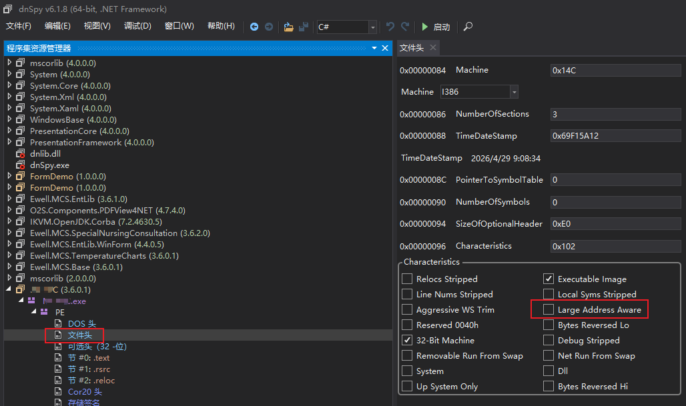

public:: true
tags:: 逆向工程工具, GitHub开源项目, .NET
license:: 未知
category:: 软件工具

- # 开源信息
	- **开源平台：** GitHub
	- **项目名称：** dnSpy
	- **使用协议：** 未知
	- **开源地址：** ((69f307bf-d223-443a-9a22-08a7631d2624))
- # 工具介绍
	- **dnSpy 是一款专业的 .NET 程序集逆向工程工具，集反编译、调试与编辑功能于一身**。
	- 它被开发者和安全人员广泛使用，核心能力是在无需任何源代码的情况下，直接分析、调试甚至修改编译后的.NET应用程序（.exe或.dll文件）。
-
- # 功能介绍
	- ## 查看与修改 Large Address Aware 配置
		- 支持查看与修改，适用于单次 Large Address Aware 修改配置。
		  id:: 69f174c4-63a6-481b-8b27-8e6dd1fa7f3c
		- 
		  id:: 69f174d6-a99d-49a7-ba56-b77f6cc6a157
-
- # 工具下载
	- 下载地址：[Releases · dnSpy/dnSpy](https://github.com/dnSpy/dnSpy/releases)
	  id:: 69f175f6-5863-46ad-9ae7-f1d74b491123
- # 相关参考
	- [GitHub：dnSpy/dnSpy: .NET debugger and assembly editor](https://github.com/dnSpy/dnSpy)
	  id:: 69f307bf-d223-443a-9a22-08a7631d2624
-
-